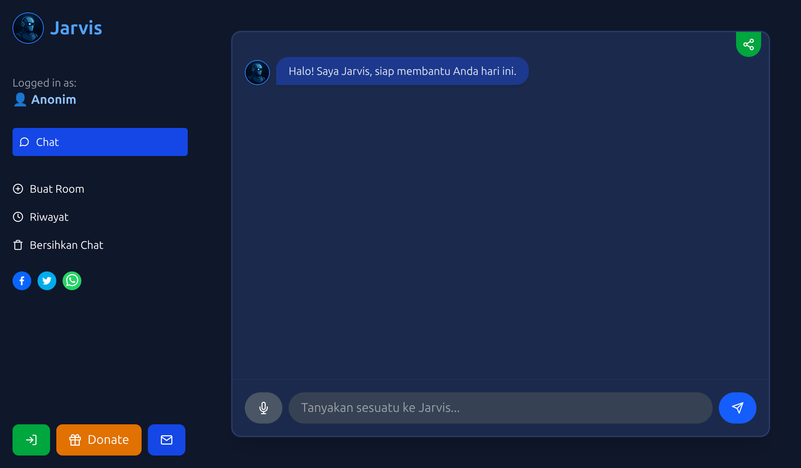
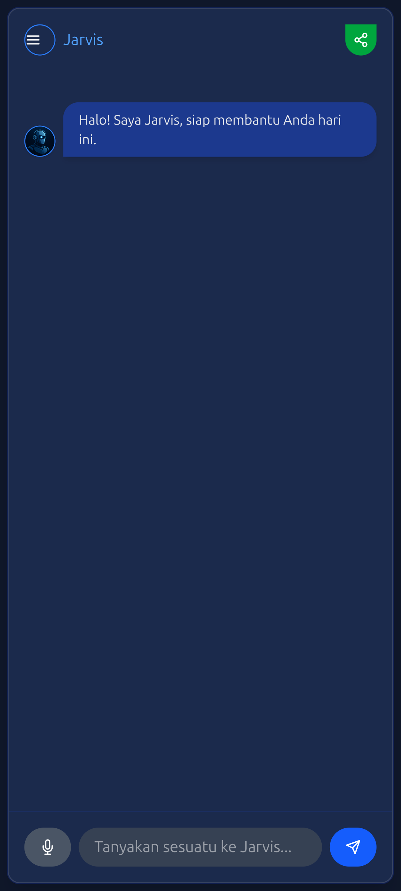
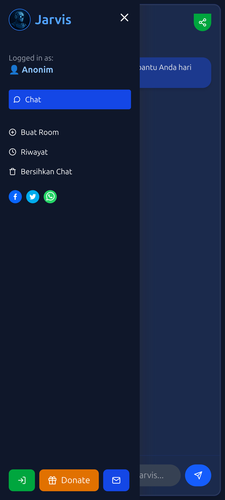

# 🤖 JarvisChat - AI Asisten Personal

**JarvisChat** adalah asisten AI buatan, yang dirancang untuk membantu pengguna dalam berbagai percakapan menggunakan teknologi GPT.

🔗 **Preview**: [https://jarvischat.pages.dev](https://jarvischat.pages.dev)

---

## ✨ Fitur Unggulan

- 💬 Chat interaktif dengan GPT-4 (via Groq API)
- 🧠 Multi-chatroom per user
- 🔒 Sistem login & register dengan verifikasi email
- 👻 Guest mode dengan limit 2 percakapan + modal dramatis
- ☁️ Firebase Firestore untuk simpan histori chat
- 💸 Laman donasi (Xendit/Midtrans support)
- 📤 Share ke media sosial
- 🗣️ Mode suara (text-to-speech + speech-to-text)
- 🧹 Bersihkan chatroom
- ⚠️ Proteksi fitur untuk pengguna guest (tidak bisa buat room, dll)

---

## 🛠️ Stack Teknologi

- Frontend: React + TailwindCSS
- Routing: React Router
- State: React Hooks
- Backend: Firebase (Auth + Firestore)
- AI Engine: Groq API (GPT-4)
- Payment: Midtrans Snap.js
- Hosting: Cloudflare Pages
- Notifikasi: Telegram Bot API

---

## 📷 Screenshot

| Tampilan dashboard dengan chatroom |
|------------------------------------|
|     |
|                       Tampilan dashboard mobile                         |
|------------------------------------|------------------------------------|
|     |     |
---

## 🚀 Cara Menjalankan

```bash
git clone https://github.com/daffadevhosting/jarvischat-AI.git
cd jarvischat-AI
npm install
npm run dev
```

---

## 📦 Build & Deploy

```bash
npm run build
```

Deploy ke Cloudflare Pages atau Vercel sesuai konfigurasi proyekmu.

---

## 📄 Lisensi

Proyek ini dilisensikan secara terbuka untuk pembelajaran dan eksplorasi pribadi. Silakan modifikasi, tapi jangan hapus referensi kreator utama.

---

## 🙏 Terima Kasih

Untuk semua pengguna awal yang mencoba Jarvis. Saran dan feedback bisa dikirim via bot Telegram. 

**Jarvis bukan sekadar bot, tapi partner digital yang setia.**